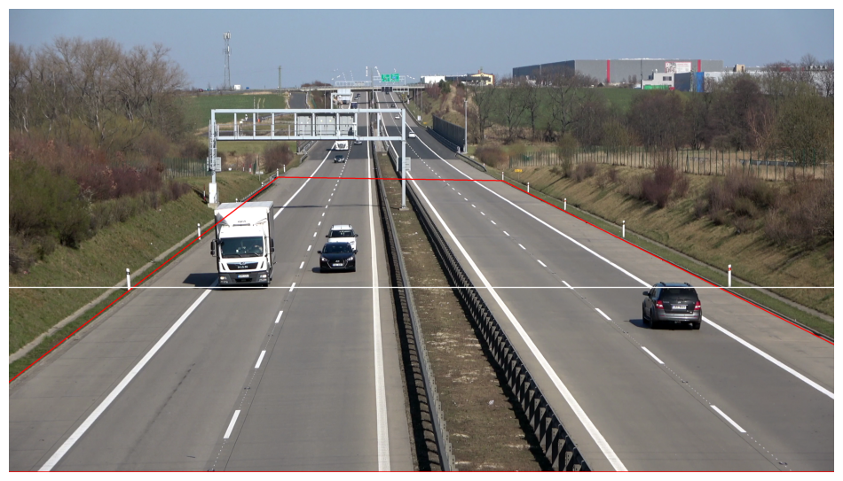
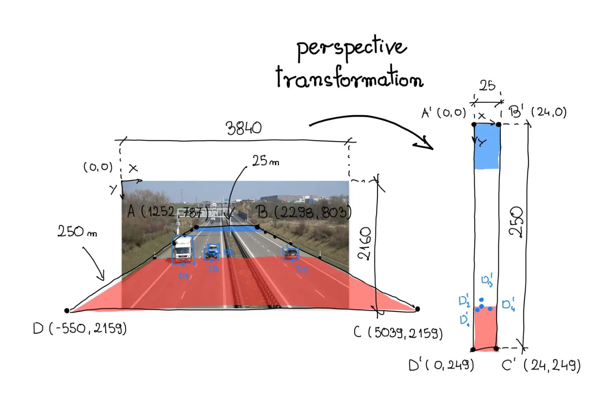
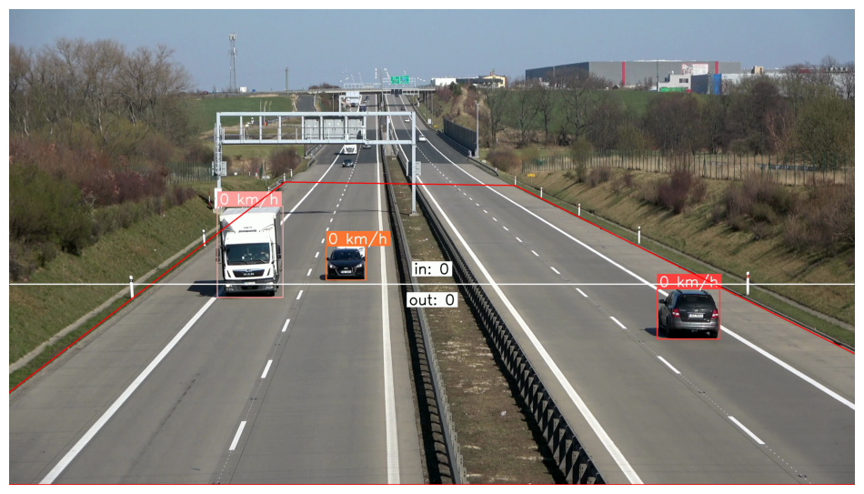

# Vehicle Counting and Speed Estimation using YOLOv10

This project implements a vehicle counting and speed estimation system using the YOLOv10 object detection model. The system processes video input to detect vehicles, track their movement, count, and estimate their speed.

## Project Structure

```bash
├── sample
│   ├── input
│   │   └── video.mp4               # Sample input video file
│   └── output
│       └── video.mp4               # Output video file with bounding boxes and speed annotations
├── weight
│   └── yolov10n.pt                 # YOLOv10 model weights
├── main.py                         # Main script for vehicle detection and speed estimation
├── README.md                       # Project documentation
└── requirements.txt                # Python dependencies
```

## How it Works

1. Model: The project uses the YOLOv10 model for vehicle detection. The model is loaded using the ultralytics library and runs on the provided video input.
2. View Transformation: The ViewTransformer class handles the transformation of points between source and target perspectives, crucial for accurate speed estimation.
3. Tracking, Count and Speed Estimation:

- The detected vehicles are tracked across frames using the ByteTrack algorithm from the supervision library.
- The vehicle only detected when entering the polygon zone (red line) as can see in Image 1.
- The line counter as can see on Image 1 (white line) will triggered when the vehicle pass the line from every direction.
- Speed is estimated by measuring the distance traveled by each vehicle in the transformed view and dividing it by the time taken.
- Output: The final output is a video with bounding boxes and speed annotations for each detected vehicle and counter vehicle from each directions as can see in Image 3.





## Getting Started

### Prerequisites

- Python 3.x

### Installation

1. Clone the repository:

```bash
git clone https://github.com/adityaazizivehicle-counting-and-speed-estimation-using-yolov10.git
cd vehicle-counting-and-speed-estimation-using-yolov10
```

2. Install the required dependencies:

```bash
pip install -r requirements.txt
```

3. Run the project:

```bash
python main.py
```

## Configuration

If you want to run with your own video you can set this configurations:

- SOURCE_VIDEO_PATH: Path to the input video file.
- TARGET_VIDEO_PATH: Path to the output video file.
- MODEL: Path to the YOLOv10 model weights.
- CONFIDENCE_THRESHOLD: Confidence threshold for vehicle detection.
- MATCH_THRESHOLD: Threshold for tracking match.
- IOU_THRESHOLD: Intersection Over Union threshold for Non-Maximum Suppression.
- MODEL_RESOLUTION: Resolution for the YOLOv10 model.

```bash
SOURCE = np.array([
    # source polygon zone
])

TARGET_WIDTH = '' # real width of the road
TARGET_HEIGHT = '' # real length of the road

TARGET = np.array([
    # target polygon zone
])

# line counter point
LINE_START = sv.Point()
LINE_END = sv.Point()
```

## Acknowledgments

- [YOLOv10 by Ultralytics](https://docs.ultralytics.com/models/yolov10/)
- [Supervision by Roboflow](https://supervision.roboflow.com/latest/)
